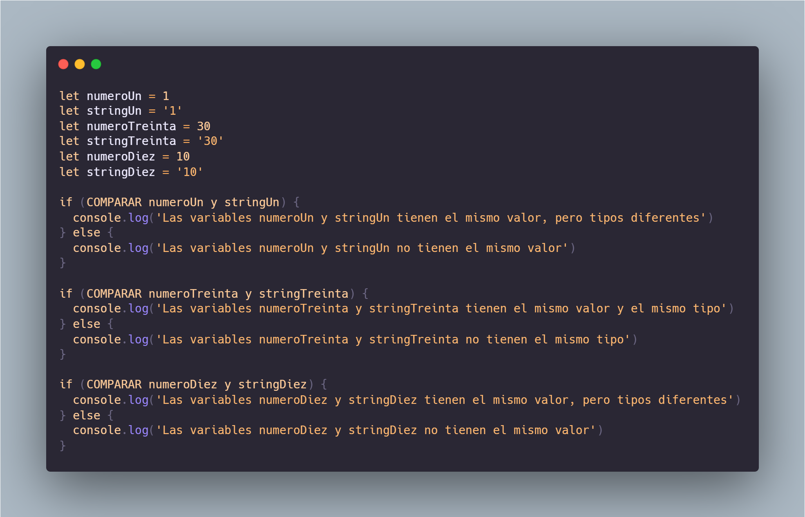

<h1 align="center">7 Days Of Code Lógica JS</h1>

  

7 Days Of Code en ONE es una iniciativa de Alura Latam para ejercitar las habilidades con desafíos diarios y prácticos para perfeccionar la lógica de programación. 

Durante 7 días recibirás desafíos con: 

- El contexto del desafío del día.
- Una tarea práctica de lógica de programación.
- Materiales adicionales para reforzar el aprendizaje.

---

## Lógica JS 1/7: Operaciones Booleanas

La parte más confusa para quienes están comenzando a aprender lógica con JavaScript es la operación de **igualdad entre valores**. Dependiendo de cómo escribas tu código, JavaScript hará una conversión de tipo a un tipo booleano de manera implícita (automática), y esto afectará a variables que eran Strings, Numbers, Object, etc.

Por lo tanto, **tu tarea es reescribir el código a continuación para que imprima la información de manera correcta**, que tenga sentido y sin errores:

  

---

## Lógica JS 2/7: Variables

Las variables son los bloques básicos de construcción de cualquier sistema y son esenciales para procesar cualquier tipo de información, ya sea de una persona que ha iniciado sesión en el sistema o incluso para mostrar detalles de productos en un catálogo de comercio electrónico.

Por eso, **desarrollaras un programa simulando una de esas aplicaciones**. Debe pedir al usuario **responder 3 preguntas**:

- ¿Cuál es tu nombre?
- ¿Cuántos años tienes?
- ¿Qué lenguaje de programación estás estudiando?

A medida que se hagan las preguntas, la persona que esté usando el programa debe responder cada una de ellas. Al final, **el sistema mostrará el mensaje**:
 
"Hola [nombre], tienes [edad] años y ya estás aprendiendo [lenguaje]!"

Observa que cada información entre [ ] es una de las respuestas dadas por la persona.

### Ejercicio Opcional

Vas a complementar el código para que, después de mostrar el mensaje anterior, el programa pregunte:

¿Te gusta estudiar [lenguaje]? Responde con el número 1 para SÍ o 2 para NO.

Y luego, dependiendo de la respuesta, debería **mostrar uno de los siguientes mensajes**:

* ¡Muy bien! Sigue estudiando y tendrás mucho éxito.
* Oh, qué pena... ¿Ya intentaste aprender otros lenguajes?

---

## Lógica JS 3/7: Estructuras de control de flujo

Los bucles (como for y while) son capaces de transformar una tarea repetitiva en pocas líneas de código, sin importar cuántas veces necesites repetir esa tarea.

Tu desafío es crear los destinos posibles de un juego, en el que el usuario pueda elegir:

1. Si quiere seguir hacia el área de **Front-End** o **seguir hacia el área de Back-End**.
2. Si está en el área de **Front-End**, si quiere **aprender React** o **aprender Vue**. Si está en el área de **Back-End**, podrá **aprender C#** o **aprender Java**.
3. Después, independientemente de las elecciones anteriores, el usuario podrá elegir entre **seguir especializándose en el área elegida o desarrollarse para convertirse en Fullstack**. Debes mostrar en pantalla un mensaje específico para cada elección.
4. Finalmente, **pregunta en qué tecnologías le gustaría a la persona especializarse o conocer**. Aquí, la persona puede responder N tecnologías, una a la vez. Entonces, mientras continúe respondiendo **ok** a la pregunta: "¿Hay alguna otra tecnología que te gustaría aprender?", sigue presentando el Prompt, para que complete el nombre de la tecnología en cuestión. Y, justo después, presenta un mensaje comentando algo sobre la tecnología ingresada.
 
Lo importante es que la persona que esté jugando siempre pueda elegir **qué decisión tomar para aprender** y desarrollarse en el área de programación. Además, también es esencial
que, al final del juego, pueda **ingresar tantas tecnologías como desee en la lista de aprendizaje**.

---

## Lógica JS 4/7: Más loops y randomización

Debes crear un pequeño programa que **comience con un valor específico predefinido entre 1 y 10** para el número que vas a adivinar (por ejemplo, el 7).

A continuación, el programa te preguntará cuál es el valor que deseas adivinar y, si aciertas, te **felicitará**. Si te equivocas, te dará **2 intentos más**. Al final, si no aciertas 
en ninguno de los intentos, **imprimirá cuál era el número inicial**.

Después de que el programa esté funcionando, intenta usar un número aleatorio en lugar de uno predefinido.

---

## Lógica JS 5/7: Arrays y colecciones

Debes crear un programa en Javascript que pregunte **si deseas agregar un alimento a tu lista de compras**, y debes poder responder con "sí" o "no".

A continuación, preguntará **qué alimento deseas agregar**, y escribirás su nombre, como por ejemplo "zanahoria".

Después, deberá preguntar **en qué categoría se encaja ese alimento**, con algunas opciones ya predefinidas, como frutas, lácteos, congelados, dulces y lo que más creas interesante. Así podrás separar todo en su respectivo grupo.

Por último, en caso de que ya no quieras agregar nada más a la lista de compras y respondas "no" a la primera pregunta, se mostrará una lista con todos los ítems agrupados, de la siguiente manera:

Si añades a tu lista:

banana, leche en polvo, tomate, leche vegetal, chicle, gominola, manzana, uva, aguacate y leche de vaca. 

El programa debería imprimir, por ejemplo:

Lista de compras:

- Frutas: banana, tomate, manzana, uva, aguacate
- Lácteos: leche vegetal, leche de vaca, leche en polvo
- Congelados: 
- Dulces: chicle y gominola

---

## Lógica JS 6/7: Remoción de arrays

Deberás crear la opción de eliminar algún elemento de la lista, que se mostrará junto con la pregunta: “**¿deseas añadir un alimento a la lista de compras?**”.

A partir de ahí, si la persona elige esa opción, el programa **imprimirá los elementos presentes en la lista actual**, y la persona deberá **escribir cuál de ellos desea eliminar**.

Después de eso, el programa **eliminará el elemento de la lista e imprimirá la confirmación de que el elemento realmente ya no está allí**.

Finalmente, el programa volverá al ciclo inicial de preguntas.

Si, al intentar eliminar el elemento, este no se encuentra en la lista, deberás mostrar un mensaje advirtiendo de ello.

Por ejemplo: “**¡No fue posible encontrar el elemento en la lista!**”.

---

##  Lógica JS 7/7: Funciones en javascript

Una excelente práctica es siempre separar cada sección de tu código que realice una función específica en bloques de código aún más pequeños, que podrán ser reutilizados y llamados en cualquier otro momento a lo largo de tu programa. Son las llamadas funciones.

**Crea una calculadora**, en donde **cada operación debe ser una función diferente en tu código**.

Primero, la persona debe elegir una opción de operación impresa por el programa en la pantalla.

Luego, debe **ingresar los dos valores que desea utilizar**, y el programa **imprimirá el resultado de la operación en cuestión**.

Las opciones disponibles deben ser: **suma, resta, multiplicación, división, y salir**.

---
